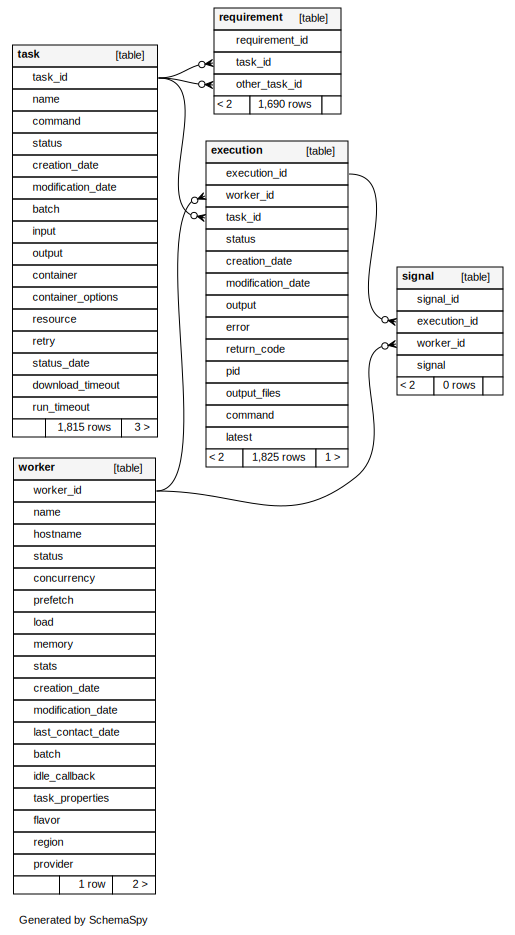
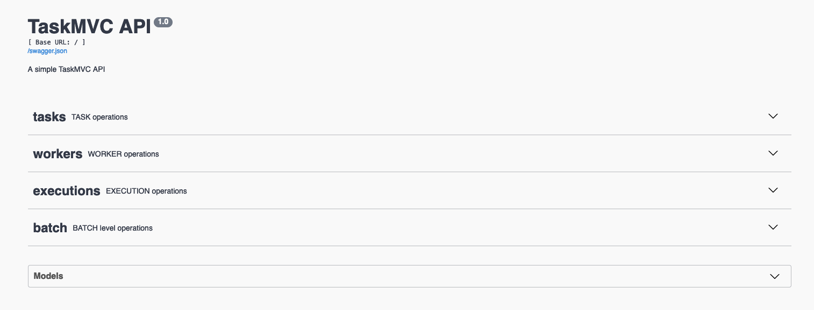

# PYTQ model and API

## PYTQ model

PYTQ is base on a simple database model. At the heart of PYTQ is the notion of:

- task 
- and worker

and without surprise, you'll find they are the two main tables of the database.



The schema include also two other tables:

- signal: a simple object which is only used to send signal to tasks (like the pause, the stop or the kill signal),
- execution: this is an important object: task can be executed several times and each execution may succeed or fail and have different outputs. Also an execution occurs on a specific worker.

Execution are not accessible simply using the [GUI](gui.md) or the [command line utility](pytq-manage.md). That is because in the vast majority of cases, the only execution that matters is the last. If a task failed, was re-excuted and succeeded in the second execution, why it failed the first time is now of lesser interest. However it is still in the database and we will learn here how to access that.

While you can connect directly to the database, there is no way we can prevent something wrong to happen if you do that, do it only if you are adapt of the YOLO principle...

## API

The API is a full REST API (operated using the excellent [Flask RESTX](https://github.com/python-restx/flask-restx) package), and it is fully exposed on `http://<your PYTQ server>:5000/` :



If you deploy any tab you'll be able to see the API details, for instance if you deploy the task tab, you will see the different REST verbs available:


And for instance, you can see what getting the task list will look like:


And now for something usefull we can list the different executions:


Note that you have a swagger.json link at the top which can help you create a client for the API. However if you plan to create a Python client, do not bother with that there is one ready made for you, and it is the next and last topic of the documentation.


## PYTQ client (pytq.lib)

### Basic usage

In the following example, we connect locally to the server (the address is thus '127.0.0.1') but pytq.lib is a REST client so it can work remotely provided the network access is granted (see [security](install.md#security)):
```python
from pytq.lib import Server
from pprint import pprint

s = Server('127.0.0.1')
pprint(s.workers())
```

```python
[{'batch': 'test',
  'concurrency': 1,
  'creation_date': datetime.datetime(2022, 11, 16, 8, 25, 25, 747354),
  'hostname': 'epeire.local',
  'idle_callback': None,
  'last_contact_date': datetime.datetime(2022, 11, 16, 17, 25, 30, 519453),
  'load': '2.7↓',
  'memory': 36.4,
  'modification_date': datetime.datetime(2022, 11, 16, 17, 20, 40, 145415),
  'name': 'epeire.local',
  'prefetch': 0,
  'read_bytes': 1411.32,
  'status': 'running',
  'worker_id': 1,
  'written_bytes': 1348.97}]
```

The function are available in a consistent style:

#### Server class functions

`workers`
:   list the workers

`worker_create_signal`
:   send a signal (like pause, term, kill) for a task on this worker

`worker_deploy`
:   deploy a new worker

`worker_get`
:   retrieve a worker detail

`worker_create`
:   low level create worker (used internally, prefer worker_deploy)

`worker_delete`
:   delete a worker

`worker_executions`
:   list executions on a certain worker

`worker_update`
:   modify (update) a worker

`workers_tasks`
:   list tasks for a worker

The different function on other objects use the same consistent logic (`tasks`, `task_update`, `task_create`, etc... for tasks, `executions`, `execution_update`, etc... for executions).
The technical documentation of pytq.lib is [here](pytq-lib.md)

#### Server style : object or dict

The server object is a simple proxy to the different REST functions that call the API. The answer is provided as is natural in Python JSON in dictionary objects. However in some cases, object style, that is argparse.Namespace, provides a more natural way of coding:

```python
from pytq.lib import Server
from pprint import pprint

s = Server('127.0.0.1', style='object')
for worker in s.workers():
    print(worker.name)
```
NB: style parameter 

#### Asynchronous 