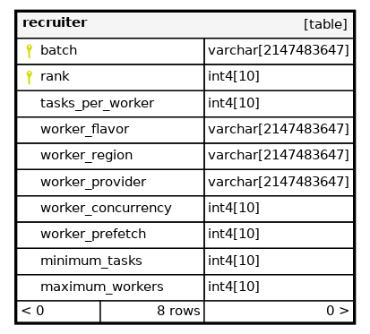
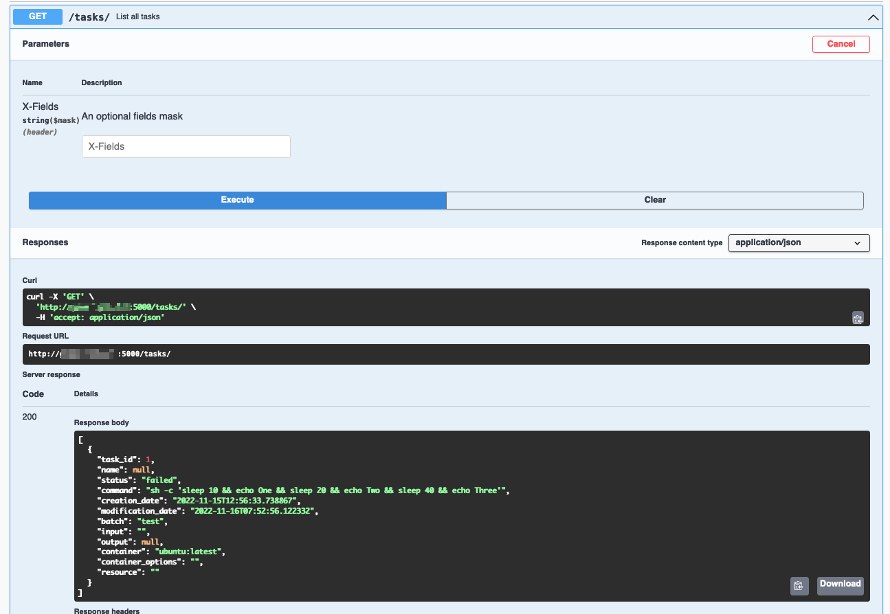
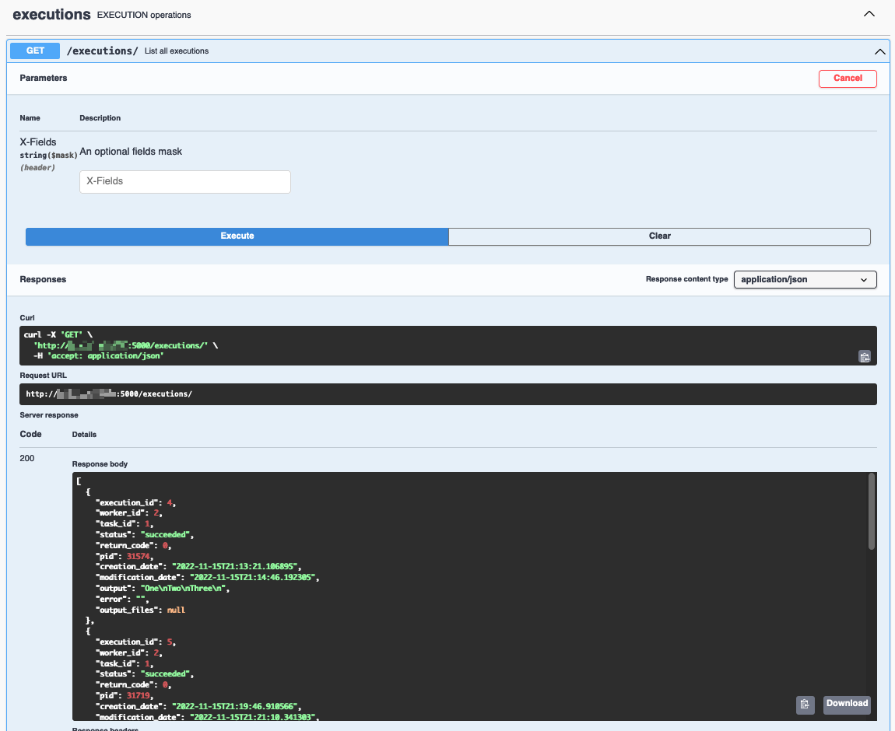

# scitq model and base API

## scitq model

scitq is base on a simple database model. At the heart of scitq is the notion of:

- task 
- and worker

and without surprise, you'll find they are the two main tables of the database.


The schema include also three other tables:

- signal: a simple object which is only used to send signal to tasks (like the pause, the stop or the kill signal),
- execution: this is an important object: task can be executed several times and each execution may succeed or fail and have different outputs. Also an execution occurs on a specific worker,
- requirement: a simple task association table to implement dependencies between task, a notion at the heart of scitq.worklow, see below.

Since v1.0rc10, a new table, job, has been added to follow internal tasks (like worker creation and destruction):


Since v1.2, a new table, recruiter, has been added to allow dynamic worker allocation for tasks (new deployments and recycling of workers). This component is also used by scitq.workflow




Execution are not accessible simply using the [GUI](gui.md) or the [command line utility](manage.md). That is because in the vast majority of cases, the only execution that matters is the last. If a task failed, was re-excuted and succeeded in the second execution, why it failed the first time is now of lesser interest. However it is still in the database and we will learn here how to access that.

A direct interaction with the database must be used with caution since of course you could do anything. However there are specific cases (notably massive update of commands) where it may be extremely efficient. These are discussed in [Using sql directly](troubleshoot.md#using-sql-directly) chapter of troubleshoot.


## API

The API is a full REST API (operated using the excellent [Flask RESTX](https://github.com/python-restx/flask-restx) package), and it is fully exposed on `http://<your scitq server>:5000/` :


If you deploy any tab you'll be able to see the API details, for instance if you deploy the task tab, you will see the different REST verbs available:


And for instance, you can see what getting the task list will look like:



And now for something usefull we can list the different executions:



Note that you have a swagger.json link at the top which can help you create a client for the API. However if you plan to create a Python client, do not bother with that there is one ready made for you, and it is the next and last topic of the documentation.


## scitq client (scitq.lib)

### Basic usage

In the following example, we connect locally to the server (the address is thus '127.0.0.1') but scitq.lib is a REST client so it can work remotely provided the network access is granted (see [security](install.md#security)):
```python
from scitq.lib import Server
from pprint import pprint

s = Server('127.0.0.1')
pprint(s.workers())
```

```python
[{'batch': 'Default',
  'concurrency': 1,
  'creation_date': datetime.datetime(2023, 4, 4, 7, 23, 52, 920295),
  'hostname': 'bioit',
  'idle_callback': None,
  'last_contact_date': datetime.datetime(2023, 5, 16, 20, 6, 35, 62751),
  'load': '0.1↓ / 0.0',
  'memory': 4.0,
  'modification_date': datetime.datetime(2023, 5, 16, 19, 36, 39, 770733),
  'name': 'bioit',
  'prefetch': 0,
  'stats': '{"load": "0.2 0.1 0.1", "disk": {"speed": "0.0/0.02 Mb/s", '
           '"usage": ["/:52", "/home:64", "/var/lib/docker:68", "/data:89", '
           '"/scratch:16", "/data/results:83", "/var/lib/postgresql:82"], '
           '"counter": "0.04/0.05 Gb"}, "network": {"speed": "0.01/0.25 Mb/s", '
           '"counter": "0.01/0.44 Gb"}}',
  'status': 'running',
  'worker_id': 1}]
```

The function are available in a consistent style:

#### Server class functions

`workers`
:   list the workers

`worker_create_signal`
:   send a signal (like pause, term, kill) for a task on this worker

`worker_deploy`
:   deploy a new worker

`worker_get`
:   retrieve a worker detail

`worker_create`
:   low level create worker (used internally, prefer worker_deploy)

`worker_delete`
:   delete a worker

`worker_executions`
:   list executions on a certain worker

`worker_update`
:   modify (update) a worker

`workers_tasks`
:   list tasks for a worker

The different function on other objects use the same consistent logic (`tasks`, `task_update`, `task_create`, etc... for tasks, `executions`, `execution_update`, etc... for executions).
The technical documentation of scitq.lib is [here](lib.md)

#### Server style : object or dict

The server object is a simple proxy to the different REST functions that call the API. The answer is provided as is natural in Python JSON in dictionary objects. However in some cases, object style, that is argparse.Namespace, provides a more natural way of coding:

```python
from scitq.lib import Server
from pprint import pprint

s = Server('127.0.0.1', style='object')
for worker in s.workers():
    print(worker.name)
```
NB: style parameter default to dictionary style, `style='dict'`.

#### Asynchronous 

scitq.lib has several goodies upon a basic REST client, and one of the best is that it is partially asynchronous. If the connection to the server is correct it will work in synchronous mode (and block on each query), but when a timeout occurs it will transparently switch to asynchronous mode (unless the server object was called with `asynchronous=False` option).

Asynchronous mode means that a special query thread will be opened and that all queries sending some information will be sent whenever possible. Queries will be executed in the same order as they were launched but the call instruction, like `s.worker_update(...)` will be non-blocking. Also, the objects or dictionaries (depending on style) returned by such queries will be lazy. Lazy means the object hold no real information, only trying to access to an attribute will trigger the real query - and will be blocking.

The get queries are always synchronous (as it is likely you'll need the information very soon after querying) and will block and retry as much as necessary, but not fail, if the server is down. 

This makes any code using scitq.lib very resilient to a server crash.


There are two parameters to be more or less aggressive, in the Server object creator:

`put_timeout`
: the time in second before switching to asynchronous when sending information (and also how frequently the query should be retried) (default to 30sec)

`get_timeout`
: the time in second before retrying when getting information (default to 150sec)

!!! note
    Lowering those times will make your code more aggressive. It can be counter-productive, notably for gets. The server will gather some resource, begin to compute what is required to answer you and... you're already gone and, worse, you will try again later... If the server is already a bit saturated, this is likely to worsen the problem.

So for instance if you want to have a resilient but very unaggressive code, you could:
```python
from scitq.lib import Server

s = Server('127.0.0.1', put_timeout=60, get_timeout=300)
```

#### Example

This is an almost literal example of a real use case of scitq at GMT Science, using [CAMISIM](https://github.com/CAMI-challenge/CAMISIM).

This suppose that:

- all the input files of CAMISIM were uploaded on `s3://rnd/camisim/camisim1/<samplename>`:
  - config.ini,
  - composition.tsv,
  - metadata.tsv
  - and id_to_genome.tsv
- the genomes (.fa files) were archived with tar and (pi)gzipped and uploaded to `s3://rnd/resource/mygenomes.tgz`,
- a private registry was set up and a docker (mainly CAMISIM public docker but with resources pre-downloaded) was uploaded to it.

We could generate almost 400 2x10M read samples in a few days with that.

Note the `s.join()` instruction at the end of the script. This instruction is reminiscent of `threading.join()` except it takes a list of tasks (such as returned by s.task_create) and can take a retry argument to relanch tasks a certain number of time.

```python
import pandas as pd
from scitq.lib import Server

s=Server('myserver')
name='camisim1'
genome_source='s3://rnd/resource/mygenomes.tgz'
DOCKER_IMAGE='privateregistry01.container-registry.ovh.net/library/camisim-shared:1.3.0.7'

with open('samples.tsv','r') as sample_file:
  samples = pd.read_csv(sample_file, sep='\t', index_col=0)
tasks = []
for sample in samples.columns:
    s3base = f's3://rnd/camisim/{name}/{sample}'
    tasks.append(
        s.task_create(
            command=f"metagenomesimulation.py /input/config.ini",
            name=sample,
            batch=name,
            input=' '.join([f'{s3base}/{item}' for item in [
                    'composition.tsv','metadata.tsv','config.ini','id_to_genome.tsv']]),
            resource=f"{genome_source}|untar",
            output=f's3://rnd/results/camisim/{name}/{sample}/',
            container=DOCKER_IMAGE
        )
    )

s.worker_deploy(number=5,
    batch=name,
    region='UK1',
    flavor='i1-180',
    concurrency=9)

s.join(tasks, retry=2)
```

!!! note
    remember to use `s.task_create(command="sh -c '...'")` (double quote outside) and not `s.task_create(command='sh -c "..."')` (simple quote outside) to prevent intermediary shell interpretation.

Since v1.2, `create_task` accept a `shell` optional argument, which default to `False`. If set to `True`, then the command is executed within a shell (`sh` shell). Shell command will be required:

- if you do anything complex such as chaining two commands with `&&` or piping `|`, 
- but also some simple stuff as shell expansion `ls *.png`, 
- or if you use environment variables `touch $OUTPUT/myemptyoutput`. 

Most of the time, using `shell=True` is harmless if not useful. However, first, we stick to python conventions, notably the behaviour of `subprocess.run`, and second, some dockers may not have a shell, in which case activating shell will trigger an error. What `shell=True` does is that it replace your <command> by `sh -c '<command>'`, but it makes the code look tidier. This also means that if your command contains single quotes `'`, it is quite unlikely to work and it will trigger a warning. You can also specify `shell='bash'` if you want a specific shell program. We recommand not to try fancy stuff such as `shell='python'`, which might work but are prone to errors.

